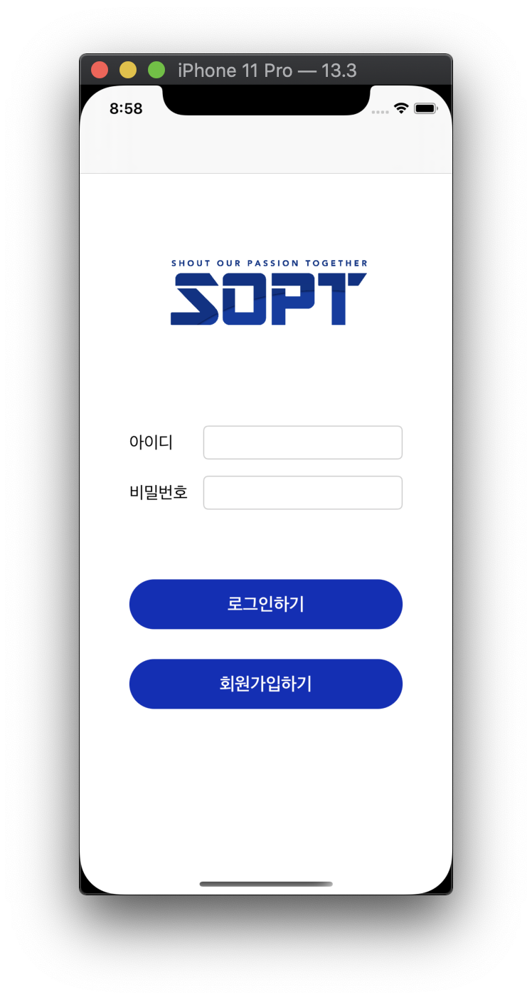

# KimNamSoo
김남수


## 목차

| 제목 | 내용 | 날짜 | 비고 |
| - | - | - | - |
| 1차 세미나 | 기본 컴포넌트, VC간 이동 | 2020.04.18(토) | |
| 2차 세미나 |  |  | |
| 3차 세미나 |  |  | |
| 4차 세미나 |  |  | |
| 5차 세미나 |  |  | |
| 6차 세미나 |  |  | |
| 7차 세미나 |  |  | |

<br>

<br>

## 1차 과제

__기한: ~2020.04.24(금)__

<div>

</div>

</br>

``` swift
    @IBAction func logoutClick(_ sender: Any) {
        // present -> dismiss, push -> pop
        dismiss(animated: true) {
             if let appDelegate = UIApplication.shared.delegate as? AppDelegate {
                (appDelegate.window?.rootViewController as? UINavigationController)?.popToRootViewController(animated: true)
            }
        }
    }
```

<br>

<br>

## 2차 

__기한:  __