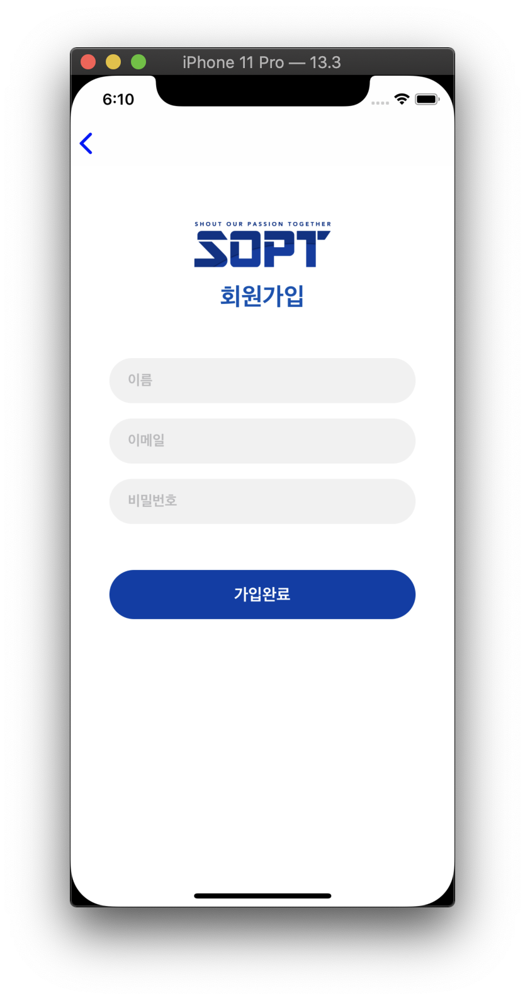

# KimNamSoo
김남수


## 목차

| 제목 | 내용 | 날짜 | 비고 |
| - | - | - | - |
| 1차 세미나 | 기본 컴포넌트 | 2020.04.18(토) | |
| [1차 과제1](#1차과제1) | VC간 이동 | 2020.04.18(토) | |
| [1차 과제2](#1차과제2) | 로그인 뷰 디자인, flow | 2020.04.18(토) | |
| 2차 세미나 | autoLayout, stackView, scrollView | 2020.04.25(토) | |
| [2차 도전과제](#2차도전과제) | 로그인뷰 디자인, 스크롤뷰 Interaction | 2020.04.25(토) | |
| 3차 세미나 |  |  | |
| 4차 세미나 |  |  | |
| 5차 세미나 |  |  | |
| 6차 세미나 |  |  | |
| 7차 세미나 |  |  | |

<br>

<br>

## 1차과제1

__기한: ~2020.04.24(금)__

* 클릭시 NavigationController를 이용한 화면전환

<div>


</div>

<br>

<br>

## 1차과제2

__기한: ~2020.04.24(금)__

<div>


</div>
</br>

⚠️ SceneDelegate를 제거한 경우에 아래코드 가능

> present된 VC를 dismiss한 후
AppDelegate의 rootVC에 접근하고
그 rootVC의 NavigationController에 접근해서
VC를 pop해주는 코드
``` swift
    @IBAction func logoutClick(_ sender: Any) {
        // present -> dismiss, push -> pop
        dismiss(animated: true) {
             if let appDelegate = UIApplication.shared.delegate as? AppDelegate {
                (appDelegate.window?.rootViewController as? UINavigationController)?.popToRootViewController(animated: true)
            }
        }
    }
```

<br>

> ## AppDelegate

* AppDelegate클래스가 만들어지고, 이 AppDelegate클래스 인스턴스인 delegate가 앱 내용이 그려질 창(window)을 만듬
* 앱의 입력 이벤트를 전달하는 run loop를 생성 

<br>

<br>

## 2차도전과제 

__기한: ~2020.05.02(금)__

<div>




</div>
<br>

> ### NavigationBar Custom속성
``` swift 
// 네비게이션 영역 그라데이션색
navigationController?.navigationBar.backgroundColor = .red
// 툴바 버튼색
navigationController?.navigationBar.tintColor = .blue
// 네비게이션 영역색
navigationController?.navigationBar.barTintColor = .white
// 네비게이션 hidden with Animation
navigationController?.setNavigationBarHidden(false, animated: false)
// 네비게이션 백버튼 텍스트
navigationController?.navigationBar.backItem?.title = ""
// 네비게이션 하단밑줄 제거
navigationController?.navigationBar.shadowImage = UIImage()
```

> ### Label Custom
``` swift 
extension UILabel {
    func underLine() {
        guard let text = self.text else {
            return
        }
        let attributedString = NSMutableAttributedString(string: text)
        attributedString.addAttribute(.underlineStyle, value: 1, range: (text as NSString).range(of: text))
        
        self.attributedText = attributedString
    }
}
```

* extension
  * 기존의 타입을 확장해서 추가하는 개념
  * 여기서 self는 Label이 됨
* NSMutableAttributedString을 이용해서 속성추가후 라벨에 적용시켜주기


> ### ScrollView Interaction (Parallax Effect)

``` swift 
    override func viewDidLoad() {
        super.viewDidLoad()
        scrollView.delegate = self
        scrollView.contentInsetAdjustmentBehavior = .never
    }
```

``` swift 
extension ScrollViewController: UIScrollViewDelegate {
    func scrollViewDidScroll(_ scrollView: UIScrollView) {
        if scrollView.contentOffset.y < 0.0 {
            // Scrolling down: Scale
            imgViewHeightLayout.constant = headerImgHeight - scrollView.contentOffset.y
        } else {
            // Scrolling up: Parallax
            var height = headerImgHeight - scrollView.contentOffset.y
            height = height > minHeaderImgHeight ? height : minHeaderImgHeight
            imgViewHeightLayout.constant = height
        }
    }
}
```

* scrollViewDidScroll - ScrollViewDelegate함수
  * 스크롤이 되면 실행되는 함수
* 스크롤뷰의 contentOffset에 따라 이미지가 커지고 작아짐
* 위로 스크롤시 최소로 보여질 높이정해주기

* contentInsetAdjustmentBehavior
	* contentInset을 자동을 조정해주는역할
	* safe area 만큼 inset이 조정됨 (여백이 생김)

</br>

</br>

## 3차 

__기한: ~2020.0.0(금)__

