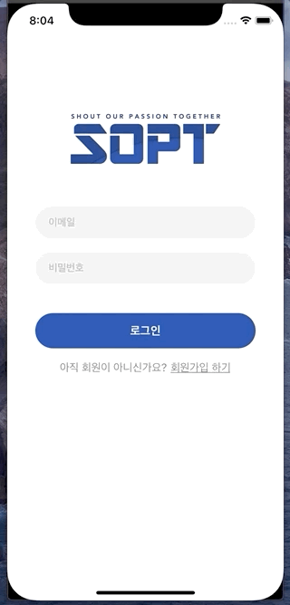

# KimNamSoo
김남수


## 목차

| 제목 | 내용 | 날짜 | 비고 |
| - | - | - | - |
| 1차 세미나 | 기본 컴포넌트 | 2020.04.18(토) | |
| [1차 과제1](#1차과제1) | VC간 이동 | 2020.04.18(토) | |
| [1차 과제2](#1차과제2) | 로그인 뷰 디자인, flow | 2020.04.18(토) | |
| 2차 세미나 | autoLayout, stackView, scrollView | 2020.04.25(토) | |
| [2차 도전과제](#2차도전과제) | 로그인뷰 디자인, 스크롤뷰 Interaction | 2020.04.25(토) | |
| 3차 세미나 | TableView, CollectionView | 2020.05.09(토) | |
| [3차 과제](#3차과제) | 친구목록 리스트 | | |
| 4차 세미나 |  |  | |
| 5차 세미나 |  |  | |
| 6차 세미나 |  |  | |
| 7차 세미나 |  |  | |

<br>

<br>

## 1차과제1

__기한: ~2020.04.24(금)__

* 클릭시 NavigationController를 이용한 화면전환

<div>


</div>

<br>

<br>

## 1차과제2

__기한: ~2020.04.24(금)__

<div>


</div>
</br>

⚠️ SceneDelegate를 제거한 경우에 아래코드 가능

> present된 VC를 dismiss한 후
AppDelegate의 rootVC에 접근하고
그 rootVC의 NavigationController에 접근해서
VC를 pop해주는 코드
``` swift
    @IBAction func logoutClick(_ sender: Any) {
        // present -> dismiss, push -> pop
        dismiss(animated: true) {
             if let appDelegate = UIApplication.shared.delegate as? AppDelegate {
                (appDelegate.window?.rootViewController as? UINavigationController)?.popToRootViewController(animated: true)
            }
        }
    }
```

<br>

> ## AppDelegate

* AppDelegate클래스가 만들어지고, 이 AppDelegate클래스 인스턴스인 delegate가 앱 내용이 그려질 창(window)을 만듬
* 앱의 입력 이벤트를 전달하는 run loop를 생성 

<br>

<br>

## 2차도전과제 

__기한: ~2020.05.02(금)__

<div>



</div>

<br>

> ### NavigationBar Custom속성
``` swift 
// 네비게이션 영역 그라데이션색
navigationController?.navigationBar.backgroundColor = .red
// 툴바 버튼색
navigationController?.navigationBar.tintColor = .blue
// 네비게이션 영역색
navigationController?.navigationBar.barTintColor = .white
// 네비게이션 hidden with Animation
navigationController?.setNavigationBarHidden(false, animated: false)
// 네비게이션 백버튼 텍스트
navigationController?.navigationBar.backItem?.title = ""
// 네비게이션 하단밑줄 제거
navigationController?.navigationBar.shadowImage = UIImage()
```

> ### Label Custom
``` swift 
extension UILabel {
    func underLine() {
        guard let text = self.text else {
            return
        }
        let attributedString = NSMutableAttributedString(string: text)
        attributedString.addAttribute(.underlineStyle, value: 1, range: (text as NSString).range(of: text))
        
        self.attributedText = attributedString
    }
}
```

* extension
  * 기존의 타입을 확장해서 추가하는 개념
  * 여기서 self는 Label이 됨
* NSMutableAttributedString을 이용해서 속성추가후 라벨에 적용시켜주기


> ### ScrollView Interaction (Parallax Effect)

``` swift 
    override func viewDidLoad() {
        super.viewDidLoad()
        scrollView.delegate = self
        scrollView.contentInsetAdjustmentBehavior = .never
    }
```

``` swift 
extension ScrollViewController: UIScrollViewDelegate {
    func scrollViewDidScroll(_ scrollView: UIScrollView) {
        if scrollView.contentOffset.y < 0.0 {
            // Scrolling down: Scale
            imgViewHeightLayout.constant = headerImgHeight - scrollView.contentOffset.y
        } else {
            // Scrolling up: Parallax
            var height = headerImgHeight - scrollView.contentOffset.y
            height = height > minHeaderImgHeight ? height : minHeaderImgHeight
            imgViewHeightLayout.constant = height
        }
    }
}
```

* scrollViewDidScroll - ScrollViewDelegate함수
  * 스크롤이 되면 실행되는 함수
* 스크롤뷰의 contentOffset에 따라 이미지가 커지고 작아짐
* 위로 스크롤시 최소로 보여질 높이정해주기

* contentInsetAdjustmentBehavior
	* contentInset을 자동을 조정해주는역할
	* safe area 만큼 inset이 조정됨 (여백이 생김)

</br>

</br>

## 3차과제

__기한: ~2020.05.15(금)__

> StoryBoard Design


HeaderView(프로필), Cell1(친구 수), Cell2(친구목록) 로 구성

</br>

<div>


</div>

Left - TableView

Center - DeleteCell

Right - ActionSheet

</br>

> 임시데이터 생성

``` swift
func fetchSampleData() {   
    mockData = MockFriendList(num: 4).data
    let headerData = MockHeader(type: .header, friendNum: mockData.count)
    mockData.insert(headerData, at: 0)
}
```

> TableView HeaderView생성

``` swift
    func tableView(_ tableView: UITableView, viewForHeaderInSection section: Int) -> UIView? {
        
        let view = UIView()
        let underLine = UIView()
        underLine.backgroundColor = #colorLiteral(red: 0.4392156863, green: 0.4392156863, blue: 0.4392156863, alpha: 1)
        let profileImg = setupProfileImgView()
        let nickLabel = setupNickLabel()
        
        view.addSubview(underLine)
        view.addSubview(profileImg)
        view.addSubview(nickLabel)
        
        nickLabel.translatesAutoresizingMaskIntoConstraints = false
        profileImg.translatesAutoresizingMaskIntoConstraints = false
        underLine.translatesAutoresizingMaskIntoConstraints = false
        NSLayoutConstraint.activate([
            profileImg.leadingAnchor.constraint(equalTo: view.leadingAnchor, constant: 16),
            profileImg.widthAnchor.constraint(equalToConstant: 60),
            profileImg.heightAnchor.constraint(equalToConstant: 60),
            profileImg.centerYAnchor.constraint(equalTo: view.centerYAnchor),
            nickLabel.leadingAnchor.constraint(equalTo: profileImg.trailingAnchor, constant: 13),
            nickLabel.centerYAnchor.constraint(equalTo: profileImg.centerYAnchor),
            underLine.heightAnchor.constraint(equalToConstant: 0.5),
            underLine.leadingAnchor.constraint(equalTo: view.leadingAnchor, constant: 16),
            underLine.trailingAnchor.constraint(equalTo: view.trailingAnchor, constant: -16),
            underLine.bottomAnchor.constraint(equalTo: view.bottomAnchor)
        ])
        
        return view
    }
    
    func setupProfileImgView() -> UIImageView {
        let imgView = UIImageView()
        imgView.image = myImg
        imgView.contentMode = .scaleAspectFill
        return imgView
    }
    
    func setupNickLabel() -> UILabel {
        let label = UILabel()
        label.text = "김남수"
        label.font = .systemFont(ofSize: 17, weight: .bold)
        label.textColor = #colorLiteral(red: 0.1529411765, green: 0.1529411765, blue: 0.1529411765, alpha: 1)
        return label
    }
```

> 타입별 Cell 생성

``` swift
    var mockData: [MockType] = []

    func tableView(_ tableView: UITableView, cellForRowAt indexPath: IndexPath) -> UITableViewCell {
        
        let cellData = mockData[indexPath.row]
        switch cellData.type {
        case .header:
            guard let cell = tableView.dequeueReusableCell(withIdentifier: HeaderTableViewCell.reuseIdentifier, for: indexPath) as? HeaderTableViewCell else {
                break
            }
            cell.friendNum = mockData.count
            return cell
        case .friend:
            guard let cell = tableView.dequeueReusableCell(withIdentifier: FriendTableViewCell.reuseIdentifier, for: indexPath) as? FriendTableViewCell else {
                break
            }
            cell.model = cellData as? MockFriend
            return cell
        default:
            break
        }
        
        return UITableViewCell(style: .default, reuseIdentifier: "")
    }
```

> Delete

``` swift
    func tableView(_ tableView: UITableView, canEditRowAt indexPath: IndexPath) -> Bool {
        return true
    }
    
    func tableView(_ tableView: UITableView, editingStyleForRowAt indexPath: IndexPath) -> UITableViewCell.EditingStyle {
        return .delete
    }
    
    func tableView(_ tableView: UITableView, commit editingStyle: UITableViewCell.EditingStyle, forRowAt indexPath: IndexPath) {
        
    }
```

위의 함수 대신에 ‼️ iOS11부터 `UISwipeActionsConfiguration`를 이용한 slide동작 구현가능‼️

Swipe기능 Custom가능

``` swift
    func tableView(_ tableView: UITableView, trailingSwipeActionsConfigurationForRowAt indexPath: IndexPath) -> UISwipeActionsConfiguration? {
        
        let deleteAction = UIContextualAction(style: .destructive, title: "잘가시츄..") { (action, view, success ) in
            self.mockData.remove(at: indexPath.row)
        }
        let config = UISwipeActionsConfiguration(actions: [deleteAction])
        config.performsFirstActionWithFullSwipe = false
        return config
    }
```


</br>

</br>

## 4차과제

__기한: ~2020.0.0(금)__
