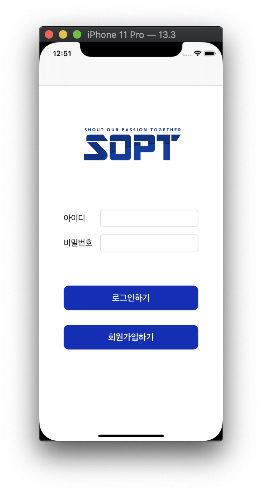
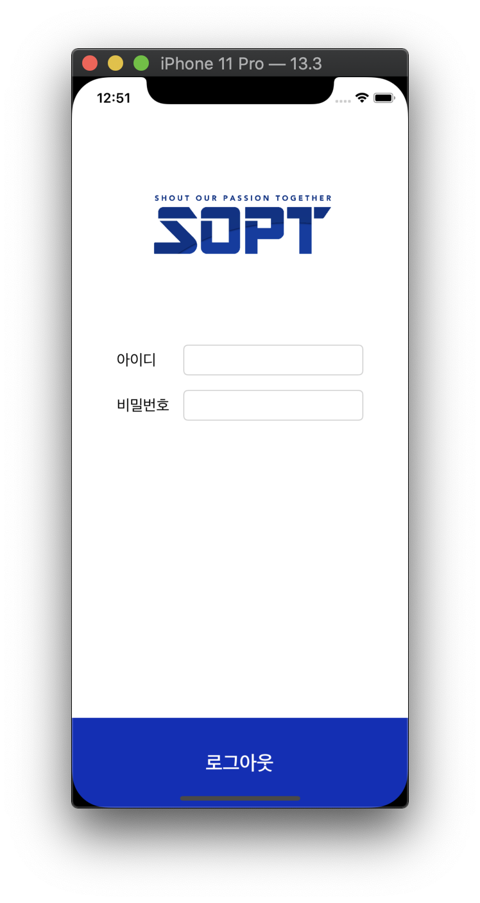

## 1차과제1

__기한: ~2020.04.24(금)__

* 클릭시 NavigationController를 이용한 화면전환

<div>


</div>

<br>

<br>

## 1차과제2

__기한: ~2020.04.24(금)__

<div>



</div>
</br>

⚠️ SceneDelegate를 제거한 경우에 아래코드 가능

> present된 VC를 dismiss한 후
AppDelegate의 rootVC에 접근하고
그 rootVC의 NavigationController에 접근해서
VC를 pop해주는 코드
``` swift
    @IBAction func logoutClick(_ sender: Any) {
        // present -> dismiss, push -> pop
        dismiss(animated: true) {
             if let appDelegate = UIApplication.shared.delegate as? AppDelegate {
                (appDelegate.window?.rootViewController as? UINavigationController)?.popToRootViewController(animated: true)
            }
        }
    }
```

<br>

> ## AppDelegate

* AppDelegate클래스가 만들어지고, 이 AppDelegate클래스 인스턴스인 delegate가 앱 내용이 그려질 창(window)을 만듬
* 앱의 입력 이벤트를 전달하는 run loop를 생성 
