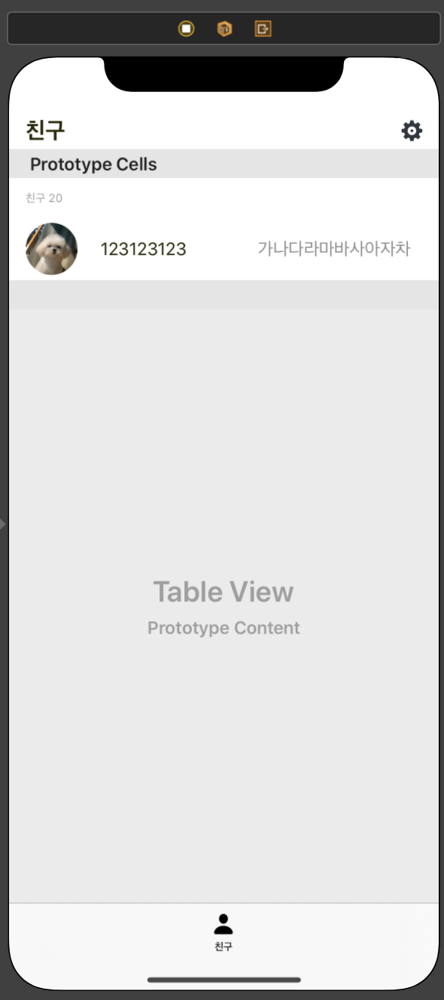
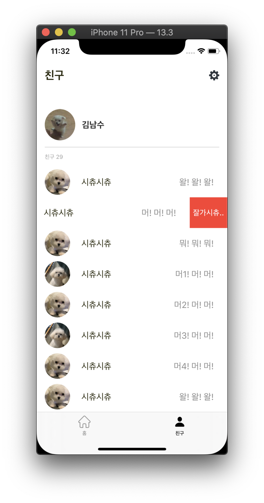

## 3차과제

__기한: ~2020.05.15(금)__

> StoryBoard Design



HeaderView(프로필), Cell1(친구 수), Cell2(친구목록) 로 구성

</br>

<div>



</div>


Left - TableView

Center - DeleteCell

Right - ActionSheet

</br>

> 임시데이터 생성

``` swift
func fetchSampleData() {   
    mockData = MockFriendList(num: 4).data
    let headerData = MockHeader(type: .header, friendNum: mockData.count)
    mockData.insert(headerData, at: 0)
}
```

> TableView HeaderView생성

``` swift
    func tableView(_ tableView: UITableView, viewForHeaderInSection section: Int) -> UIView? {
        
        let view = UIView()
        let underLine = UIView()
        underLine.backgroundColor = #colorLiteral(red: 0.4392156863, green: 0.4392156863, blue: 0.4392156863, alpha: 1)
        let profileImg = setupProfileImgView()
        let nickLabel = setupNickLabel()
        
        view.addSubview(underLine)
        view.addSubview(profileImg)
        view.addSubview(nickLabel)
        
        nickLabel.translatesAutoresizingMaskIntoConstraints = false
        profileImg.translatesAutoresizingMaskIntoConstraints = false
        underLine.translatesAutoresizingMaskIntoConstraints = false
        NSLayoutConstraint.activate([
            profileImg.leadingAnchor.constraint(equalTo: view.leadingAnchor, constant: 16),
            profileImg.widthAnchor.constraint(equalToConstant: 60),
            profileImg.heightAnchor.constraint(equalToConstant: 60),
            profileImg.centerYAnchor.constraint(equalTo: view.centerYAnchor),
            nickLabel.leadingAnchor.constraint(equalTo: profileImg.trailingAnchor, constant: 13),
            nickLabel.centerYAnchor.constraint(equalTo: profileImg.centerYAnchor),
            underLine.heightAnchor.constraint(equalToConstant: 0.5),
            underLine.leadingAnchor.constraint(equalTo: view.leadingAnchor, constant: 16),
            underLine.trailingAnchor.constraint(equalTo: view.trailingAnchor, constant: -16),
            underLine.bottomAnchor.constraint(equalTo: view.bottomAnchor)
        ])
        
        return view
    }
    
    func setupProfileImgView() -> UIImageView {
        let imgView = UIImageView()
        imgView.image = myImg
        imgView.contentMode = .scaleAspectFill
        return imgView
    }
    
    func setupNickLabel() -> UILabel {
        let label = UILabel()
        label.text = "김남수"
        label.font = .systemFont(ofSize: 17, weight: .bold)
        label.textColor = #colorLiteral(red: 0.1529411765, green: 0.1529411765, blue: 0.1529411765, alpha: 1)
        return label
    }
```

> 타입별 Cell 생성

``` swift
    var mockData: [MockType] = []

    func tableView(_ tableView: UITableView, cellForRowAt indexPath: IndexPath) -> UITableViewCell {
        
        let cellData = mockData[indexPath.row]
        switch cellData.type {
        case .header:
            guard let cell = tableView.dequeueReusableCell(withIdentifier: HeaderTableViewCell.reuseIdentifier, for: indexPath) as? HeaderTableViewCell else {
                break
            }
            cell.friendNum = mockData.count
            return cell
        case .friend:
            guard let cell = tableView.dequeueReusableCell(withIdentifier: FriendTableViewCell.reuseIdentifier, for: indexPath) as? FriendTableViewCell else {
                break
            }
            cell.model = cellData as? MockFriend
            return cell
        default:
            break
        }
        
        return UITableViewCell(style: .default, reuseIdentifier: "")
    }
```

> Delete

``` swift
    func tableView(_ tableView: UITableView, canEditRowAt indexPath: IndexPath) -> Bool {
        return true
    }
    
    func tableView(_ tableView: UITableView, editingStyleForRowAt indexPath: IndexPath) -> UITableViewCell.EditingStyle {
        return .delete
    }
    
    func tableView(_ tableView: UITableView, commit editingStyle: UITableViewCell.EditingStyle, forRowAt indexPath: IndexPath) {
        
    }
```

위의 함수 대신에 ‼️ iOS11부터 `UISwipeActionsConfiguration`를 이용한 slide동작 구현가능‼️

Swipe기능 Custom가능

``` swift
    func tableView(_ tableView: UITableView, trailingSwipeActionsConfigurationForRowAt indexPath: IndexPath) -> UISwipeActionsConfiguration? {
        
        let deleteAction = UIContextualAction(style: .destructive, title: "잘가시츄..") { (action, view, success ) in
            self.mockData.remove(at: indexPath.row)
        }
        let config = UISwipeActionsConfiguration(actions: [deleteAction])
        config.performsFirstActionWithFullSwipe = false
        return config
    }
```


</br>

</br>