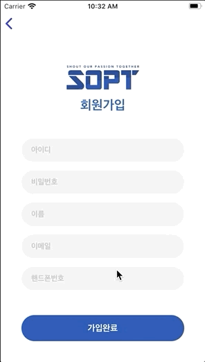

## 4차과제

__기한: ~2020.05.22(금)__


<div>


</div>
<br>

***

> ### Alamofire 5.1사용

``` swift 
        let request = AF.request(url,
                                 method: .post,
                                 parameters: body,
                                 encoding: JSONEncoding.default,
                                 headers: header)
        request
            .validate(statusCode: 200..<500)
            .responseDecodable(of: SimpleResponse<String>.self) { response in
                switch response.result {
                case .success:
                    guard let code = response.value?.status,
                        let httpCode = HttpStatusCode(rawValue: code) else {
                            completion(.failed(NSError(domain: "StatusCode Err",
                                                       code: 0,
                                                       userInfo: nil)))
                            return
                    }
                    completion(.success(httpCode))
                case .failure(let err):
                    print(err)
                    completion(.failed(err))
                }
        }
```

> ## 변경사항

* ### validate(statusCode: )
  
  유효한 statusCode를 분류가능
  
  이 코드속에 속해야만 실행가능
  
  여기서 말하는 statusCode는 헤더로 날라오는 코드
  
  json안의 status와 다름 주의


* ### responseDecodable(of: )

  원하는 모델로 바로 디코딩해서 반환

  responseJson도 이용가능

  > 5.0이전 버전 디코딩방식

  ``` swift
  let decoder = JSONDecoder()
  let json = try decoder.decode(LoginResult.self, from: result)
  ```
  
  >  5.0이후 버전 디코딩방식

  ``` swift
  .responseDecodable(of: SimpleResponse<LoginResult>.self) { response in
      
  }
  ```

  

<br>

***

<br>

## 자동로그인

  ``` swift 
    func isAutoLogin() {
        if UserDefaults.standard.bool(forKey: UserDefaultName.isAutoLogin.rawValue) {
            guard let nextVC = self.storyboard?.instantiateViewController(withIdentifier: "TabBarC") else {
                return
            }
            present(nextVC, animated: true)
        }
    }
  ```

* UserDefaults를 사용할 때 forKey:에 키값이 될 문자열을 넣어준다
* 문자열을 어디선가 또사용할 거기 때문에 일반 문자열을 넣어두되지만 타입으로 관리하는게 더 용이하다
* 로그인 성공시 자동로그인의 값을 true로 로그아웃시 false로 설정


<br>


## 서버 모델

  ``` swift 
struct SimpleResponse<T: Codable>: Codable {
    let status: Int?
    let success: Bool?
    let message: String?
    let data: T?
    
    enum CodingKeys: CodingKey {
        case status, success, message, data
    }
    
    init(from decoder: Decoder) throws {
        let values = try decoder.container(keyedBy: CodingKeys.self)
        status = (try? values.decode(Int.self, forKey: .status)) ?? nil
        success = (try? values.decode(Bool.self, forKey: .success)) ?? nil
        message = (try? values.decode(String.self, forKey: .message)) ?? nil
        data = (try? values.decode(T.self, forKey: .data)) ?? nil
    }
}
  ```

* T는 제네릭을 나타냄
* 제네릭이란 해당하는 곳에 어떠한 타입이든 들어올 수 있음을 명시
  제네릭을 적용한 곳에 입력한 타입이 모두 적용됨

<br>

## 회원가입

  ``` swift 
    @IBAction func signUpCompleteClick(_ sender: Any) {
        
        guard idTextField.hasText &&
            pwTextField.hasText &&
            nameTextField.hasText &&
            emailTextField.hasText &&
            phoneTextField.hasText else {
                simpleAlert(title: nil, msg: "빈칸을 채워주세요")
                return
        }
        let form = SignUpForm(id: idTextField.text, pw: pwTextField.text, name: nameTextField.text, email: emailTextField.text, phone: phoneTextField.text)
        
        service.requestSignUp(form: form) { result in
            switch result {
            case .success(let statusCode):
                DispatchQueue.main.async {
                    switch statusCode {
                    case .existId:
                        self.simpleAlert(title: "이미 아이디가 존재합니다.", msg: nil)
                    case .success:
                        self.simpleAlert(title: "회원 가입 성공", msg: nil)
                    case .serverError:
                        self.simpleAlert(title: "서버오류", msg: nil)
                    default:
                        break
                    }
                }
            case .failed(let err):
                print(err)
            }
        }
        
    }

  ```

* `guard let id = idTextField else { return }` 은 TextField의 __빈칸을 거를 수 없다__
* 아래의 방법으로 거를 수 있고 그중에서 hasText가 제일 좋은 방법이라고 생각
  * `idTextField.text.isEmpty`
  * `idTextField.text.count`
  * `idTextField.hasText`


